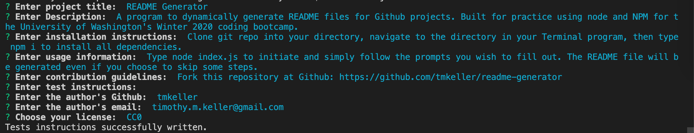

# README Generator

## Table of Contents
1. [Description](#description)
2. [Installation](#installation)
3. [Usage](#usage)
4. [Contributing](#contributing)
5. [Questions](#questions)
6. [License](#license)
## Description
A program to dynamically generate README files for Github projects. Built for practice using node and NPM for the University of Washington's Winter 2020 coding bootcamp.

## Installation
Clone git repo into your directory, navigate to the directory in your Terminal program, then type npm i to install all dependencies.

## Usage
Type node index.js to initiate and simply follow the prompts you wish to fill out. The README file will be generated even if you choose to skip some steps.

## Contributing
Fork this repository at Github: https://github.com/tmkeller/readme-generator

## Questions
Written by [tmkeller](https://github.com/tmkeller) on Github 
Email the author at timothy.m.keller@gmail.com

## License
[CC0](http://creativecommons.org/publicdomain/zero/1.0/)